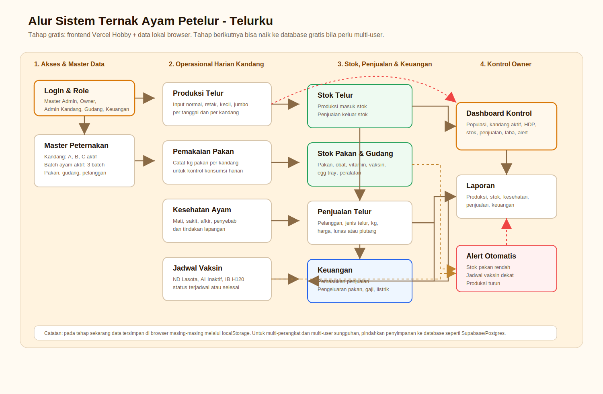

# Alur Sistem Ternak Ayam Petelur - Telurku

Dokumen ini menjelaskan arah pengembangan sistem ternak berdasarkan data dan modul yang sudah ada di aplikasi saat ini. Fokus tahap pertama adalah tetap gratis: memakai frontend yang sudah deploy di Vercel Hobby dan data lokal/mock untuk validasi alur kerja sebelum masuk ke database sungguhan.

## Kondisi sistem saat ini

Data aplikasi saat ini berasal dari `src/lib/mock-data.ts` lalu disimpan ke `localStorage` melalui `src/lib/store.tsx`. Artinya data bisa berubah di browser pengguna, tetapi belum tersinkron antar perangkat dan belum menjadi database produksi.

Modul yang sudah tersedia:

| Area | Data yang sudah ada | Fungsi utama |
| --- | --- | --- |
| Akses pengguna | Master Admin, Owner, Admin Kandang, Petugas Gudang, Keuangan, Viewer | Login sederhana dan pembagian peran awal |
| Kandang | Kandang A, B, C aktif, Kandang D maintenance | Monitoring kapasitas, lokasi, jenis kandang, penanggung jawab |
| Populasi ayam | 3 batch aktif dengan strain dan jumlah ayam aktif | Kontrol populasi, umur batch, status afkir |
| Produksi telur | Produksi 14 hari per kandang | Input normal, retak, kecil, jumbo, berat total |
| Pakan | Stok pakan, minimum stok, harga per kg | Kontrol stok dan kebutuhan pembelian |
| Pemakaian pakan | Pemakaian 7 hari per kandang | Hitung konsumsi harian dan efisiensi pakan |
| Kesehatan | Mati, sakit, afkir, penyebab, tindakan | Kontrol mortalitas dan tindakan lapangan |
| Jadwal vaksin | Vaksin ND Lasota, AI Inaktif, IB H120 | Reminder jadwal dan status vaksinasi |
| Stok telur | Normal, kecil, jumbo, retak, reject | Kontrol barang siap jual |
| Penjualan | Pelanggan, jenis telur, kg, harga, status pembayaran | Catat transaksi penjualan telur |
| Keuangan | Pemasukan dan pengeluaran | Hitung kas, laba harian, biaya operasional |
| Gudang | Pakan, obat, vitamin, vaksin, egg tray, peralatan | Kontrol inventori pendukung |

## Alur data utama

1. Admin mengatur master data: user, kandang, batch ayam, pakan, gudang, dan pelanggan.
2. Petugas kandang mencatat kegiatan harian: produksi telur, pemakaian pakan, kondisi kesehatan, dan jadwal vaksin.
3. Produksi telur menambah stok telur. Penjualan mengurangi stok telur.
4. Pemakaian pakan dan pembelian pakan mempengaruhi stok pakan/gudang.
5. Penjualan masuk ke pemasukan. Pembelian pakan, gaji, listrik, obat, dan kebutuhan lain masuk ke pengeluaran.
6. Dashboard menarik ringkasan dari seluruh modul: populasi, kandang aktif, HDP, stok telur, stok pakan, penjualan, laba, dan alert.
7. Laporan mengambil data historis dari produksi, kesehatan, stok, penjualan, dan keuangan.

## Alert yang perlu dikembangkan

Alert sebaiknya menjadi pusat kontrol owner/admin. Dari data sekarang, alert paling penting adalah:

| Alert | Sumber data | Aturan awal |
| --- | --- | --- |
| Stok pakan rendah | Pakan/Gudang | `stok < minStok` |
| Jadwal vaksin dekat | Jadwal | Status Terjadwal dan tanggal mendatang |
| Produksi turun | Produksi | Rata-rata 7 hari terakhir turun lebih dari 10 persen dibanding 7 hari sebelumnya |
| Mortalitas tinggi | Kesehatan | Jumlah mati harian melewati batas normal |
| Piutang pelanggan | Penjualan | Status penjualan masih Piutang |
| Stok telur menumpuk | Stok Telur | Stok siap jual terlalu tinggi dibanding rata-rata penjualan |

## Tahap gratis yang disarankan

Tahap 1 bisa tetap gratis dan cukup untuk demo, validasi workflow, dan pemakaian internal kecil:

1. Pertahankan Vercel Hobby untuk hosting frontend.
2. Pertahankan `localStorage` untuk prototype, tetapi beri tombol export/import JSON agar data tidak mudah hilang.
3. Rapikan dashboard menjadi pusat kontrol dengan kartu yang terhubung ke halaman terkait.
4. Tambahkan halaman "Operasional Harian" agar petugas bisa input produksi, pakan, kesehatan, dan vaksin dari satu tempat.
5. Tambahkan laporan sederhana yang bisa difilter tanggal dan diekspor CSV.

Keterbatasan tahap gratis saat ini:

| Batasan | Dampak |
| --- | --- |
| Data di `localStorage` | Data hanya aman di browser yang sama |
| Login masih mock | Belum cocok untuk data produksi |
| Tidak ada database pusat | Owner tidak bisa melihat input dari perangkat lain secara real-time |
| Tidak ada backup otomatis | Data bisa hilang jika browser dibersihkan |

## Tahap gratis berikutnya bila perlu multi-user

Jika aplikasi sudah perlu dipakai beberapa perangkat, opsi gratis berikutnya adalah menambahkan backend/database free tier. Pola yang paling praktis:

1. Vercel tetap menjadi hosting frontend.
2. Database pindah ke Supabase/Postgres free tier.
3. Auth pindah ke Supabase Auth atau sistem login berbasis tabel user.
4. Data lokal hanya dipakai sebagai cache sementara, bukan sumber utama.
5. Tambahkan role policy agar petugas hanya bisa input data sesuai tugasnya.

Struktur tabel awal yang disarankan:

| Tabel | Relasi utama | Catatan |
| --- | --- | --- |
| `users` | role | Akun dan akses pengguna |
| `kandang` | penanggung jawab | Master kandang |
| `batch_ayam` | `kandang_id` | Populasi ayam per batch |
| `produksi_telur` | `kandang_id`, `batch_id` | Data produksi harian |
| `pakan` | - | Master stok pakan |
| `pemakaian_pakan` | `kandang_id`, `pakan_id` | Konsumsi harian |
| `kesehatan` | `kandang_id`, `batch_id` | Mati, sakit, afkir |
| `jadwal_vaksin` | `kandang_id`, `batch_id` | Jadwal dan status |
| `stok_telur_mutasi` | produksi/penjualan | Mutasi stok masuk dan keluar |
| `pelanggan` | - | Master pelanggan |
| `penjualan` | `pelanggan_id` | Penjualan dan status pembayaran |
| `transaksi_keuangan` | referensi transaksi | Pemasukan dan pengeluaran |
| `barang_gudang` | - | Inventori pendukung |

## Prioritas pengembangan

Urutan terbaik agar sistem ternak makin kuat tanpa langsung mahal:

1. Rapikan data operasional harian dalam satu alur input.
2. Tambahkan export/import backup JSON.
3. Tambahkan validasi stok otomatis saat produksi dan penjualan.
4. Tambahkan alert yang bisa diklik dan ditandai selesai.
5. Tambahkan laporan filter tanggal dan CSV.
6. Baru pindahkan storage ke database gratis ketika sudah butuh multi-user/multi-device.

## Prinsip kontrol informasi

Dashboard tidak cukup hanya menampilkan angka. Setiap angka harus bisa dikontrol:

| Informasi dashboard | Halaman kontrol |
| --- | --- |
| Populasi ayam aktif | Populasi |
| Kandang aktif | Kandang |
| Produksi hari ini dan HDP | Produksi |
| Konsumsi dan stok pakan | Pakan/Gudang |
| Ayam mati/sakit | Kesehatan |
| Stok telur siap jual | Stok Telur |
| Penjualan hari ini | Penjualan |
| Pengeluaran dan estimasi laba | Keuangan |
| Total alert | Jadwal/Alert |

Dengan pola ini, owner bisa melihat ringkasan, lalu langsung masuk ke sumber masalah tanpa mencari menu satu per satu.
